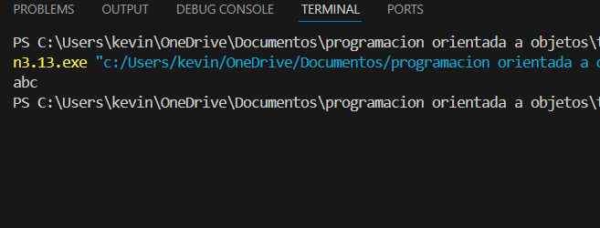

# Taller de Modificadores de Acceso en Python

## Pregunta 1
**¿Cuáles de los siguientes atributos son accesibles desde fuera de la clase?**

- `x` 
- `_y`
- `__z` 

**Respuesta:** 

a,b

`x` y `_y` son accesibles directamente. `__z` solo mediante "name mangling".  

---
## pregunta 2

class A:
    def __init__(self):
        self.__secret = 42

a = A()
print(hasattr(a, '__secret'), hasattr(a, '_A__secret'))

**¿que imprime?**

**respuesta**

false true

---
## Pregunta 3
**Verdadero/Falso (explica por qué)**

- El prefijo _ impide el acceso desde fuera.  Falso. Solo es convención.
- El prefijo __ hace imposible acceder.  Falso. Se puede acceder con name mangling.
- El name mangling depende del nombre de la clase.  Verdadero.
---
## pregunta 4

class Base:
    def __init__(self):
        self._token = "abc"

class Sub(Base):
    def reveal(self):
        return self._token

print(Sub().reveal())

**que imprime y por que no da error?**

**respuesta**

Imprime: abc.

No hay error porque _token es solo convención, no restricción real.

---

## Pregunta 5

class Base:
    def __init__(self):
        self.__v = 1

class Sub(Base):
    def __init__(self):
        super().__init__()
        self.__v = 2
    def show(self):
        return (self.__v, self._Base__v)

print(Sub().show())

**cual es la salida?**

**resouesta**

Salida: (2, 1).

---

## pregunta 6

**Identifica el error**

class Caja:
__slots__ = ('x',)
c = Caja()
c.x = 10
c.y = 20

**por que**

Con __slots__, solo se pueden definir atributos listados en la tupla. Aquí solo x está permitido. Cuando intentamos asignar c.y, Python lanza un error porque y no está en __slots__.

**error**

---

## Ejercicio 7

**Rellenar espacios**

class B:
    def __init__(self):
        self._____ = 99

**respuesta**
self._valor = 99

---

## ejercicio 8

**Lectura de métodos “privados”**

class M:
    def __init__(self):
        self._state = 0
    def _step(self):
        self._state += 1
        return self._state
    def __tick(self):
        return self._step()

m = M()
print(hasattr(m, '_step'), hasattr(m, '__tick'), hasattr(m, '_M__tick'))

**¿Qué imprime y por qué?**

True False True

**¿por que?**

_step existe asi que da = True.

__tick no existe con ese nombre (se manglea) y por eso da = False.

_M__tick existe tras el name mangling asi que da = True.

---
## ejercicio 9

**Acceso a atributos privados**

class S:
    def __init__(self):
        self.__data = [1, 2]
    def size(self):
        return len(self.__data)

s = S()

**respuesta**

print(s._S__data)

---
## ejercicio 10

**Comprensión de dir y mangling**

class D:
def __init__(self):
self.__a = 1
self._b = 2
self.c = 3
d = D()
names = [n for n in dir(d) if 'a' in n]
print(names)

**respuesta**

El nombre que aparece es _D__a.

---

## ejercicio 11

**Completar propiedad con validación. Completa para que saldo nunca sea negativo.**

**respuesta**

class Cuenta:
    def __init__(self, saldo):
        self._saldo = 0
        self.saldo = saldo

    @property
    def saldo(self):
        return self._saldo

    @saldo.setter
    def saldo(self, value):
        if value < 0:
            raise ValueError("Saldo no puede ser negativo")
        self._saldo = value

---

## ejercicio 12

**Propiedad de solo lectura**

Convierte temperatura_f en un atributo de solo lectura que se calcula desde
temperatura_c.

**respuesta**

class Termometro:
    def __init__(self, temperatura_c):
        self._c = float(temperatura_c)

    @property
    def temperatura_f(self):
        return self._c * 9/5 + 32

---
## ejercicio 13

**Invariante con tipo**

Haz que nombre sea siempre str. Si asignan algo que no sea str, lanza TypeError.

**respuesta**

class Usuario:
    def __init__(self, nombre):
        self.nombre = nombre

    @property
    def nombre(self):
        return self._nombre

    @nombre.setter
    def nombre(self, value):
        if not isinstance(value, str):
            raise TypeError("nombre debe ser str")
        self._nombre = value

---

## ejercicio 14

**Encapsulación de colección**

class Registro:
    def __init__(self):
        self.__items = []

    def add(self, x):
        self.__items.append(x)

    @property
    def items(self):
        return tuple(self.__items)

---

## ejercicio 15

**Refactor a encapsulación**

Refactoriza para evitar acceso directo al atributo y validar que velocidad sea entre 0 y
200.

**respuesta**

class Motor:
    def __init__(self, velocidad):
        self.velocidad = velocidad

    @property
    def velocidad(self):
        return self._velocidad

    @velocidad.setter
    def velocidad(self, value):
        if not 0 <= value <= 200:
            raise ValueError("Velocidad fuera de rango (0-200)")
        self._velocidad = value

---

## ejercicio 16
**Elección de convención**

Explica con tus palabras cuándo usarías _atributo frente a __atributo en una API
pública de una librería.

**respuesta**

Se usa _atributo cuando algo es interno de la clase y no debería tocarse desde fuera, pero si alguien lo hace, tampoco pasa nada grave (es más como una advertencia).

Se usa __atributo cuando quieres ocultarlo mejor, ya sea porque no quieres que lo usen directamente o para evitar problemas si la clase se hereda (Python lo camufla con name mangling).

---

## ejercicio 17

**Detección de fuga de encapsulación**

¿Qué problema hay aquí?

class Buffer:
def __init__(self, data):
self._data = list(data)
def get_data(self):
return self._data

**respuesta**
class Buffer:
    def __init__(self, data):
        self._data = list(data)
    def get_data(self):
        return list(self._data)  # devuelve copia

El problema es que la clase estaba entregando la lista real que usaba por dentro.
Eso significa que desde afuera alguien podía agarrarla y cambiarla, dañando el estado interno del objeto sin control.

Con la corrección, en lugar de dar la lista original, se devuelve una copia. Así, aunque la persona de afuera intente modificarla, no afecta lo que guarda la clase internamente.

## ejercicio 18

